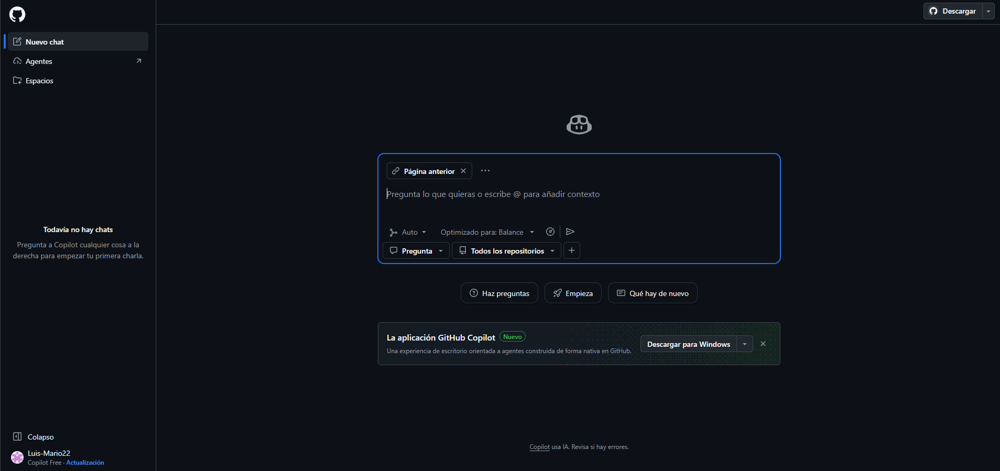
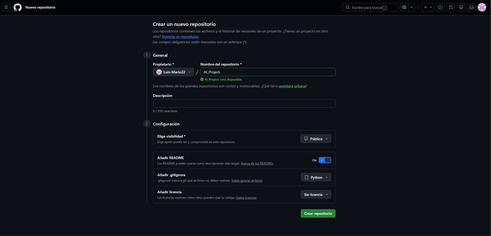
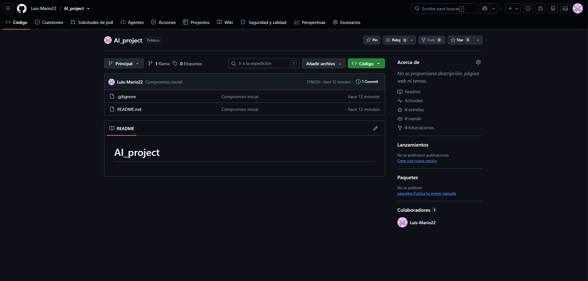
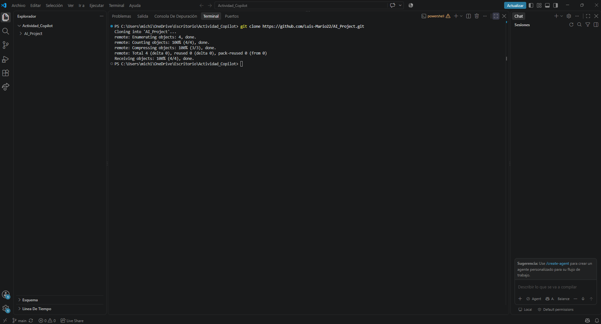
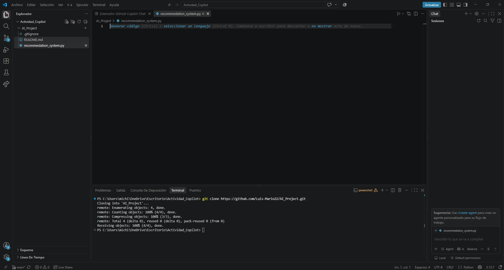
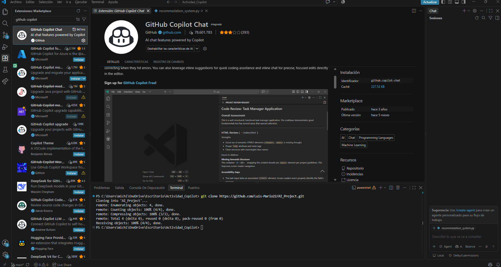
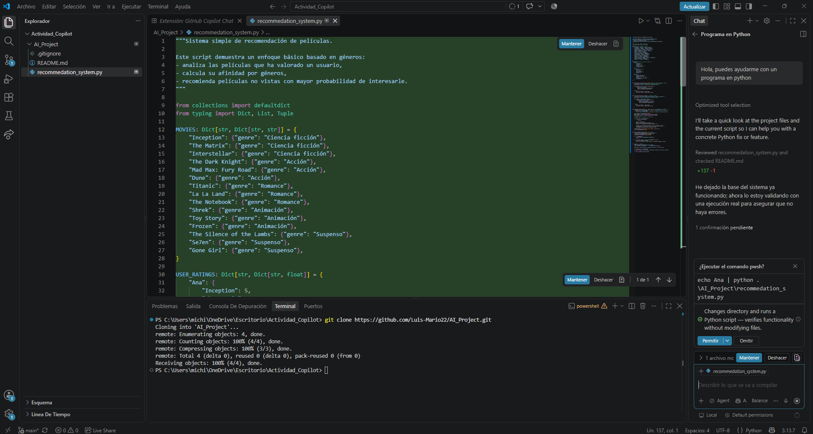
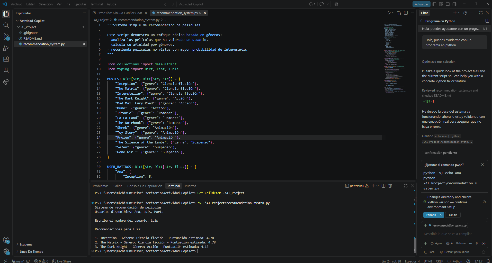
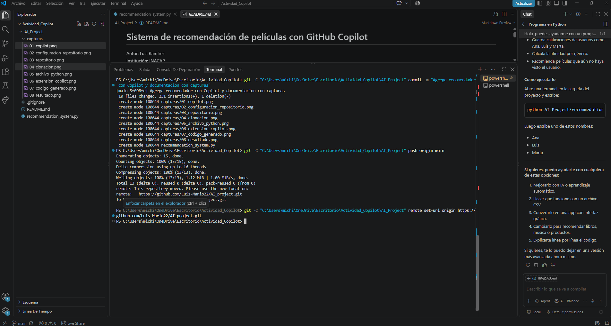

# Sistema de recomendación de películas con GitHub Copilot

Autor: Luis Ramírez  
Institución: INACAP

## Objetivo

Explorar el uso de GitHub Copilot para generar y revisar un programa
en Python que recomienda películas según las valoraciones de usuarios.

## 1. Acceso a Copilot

Solicité el beneficio de estudiante, pero GitHub rechazó la verificación.
Para continuar con la actividad, activé Copilot Free con mi cuenta.

## 2. Configuración del repositorio

Configuré un repositorio público con README y un archivo .gitignore
para Python. No añadí una licencia.

## 3. Repositorio creado

Creé el repositorio en GitHub para guardar el código y las evidencias.

## 4. Clonación

Cloné el repositorio desde la terminal de Visual Studio Code
para trabajar con los archivos en mi computadora.

## 5. Archivo Python

Creé el archivo recommendation_system.py dentro del repositorio.

## 6. Copilot en Visual Studio Code

Comprobé que GitHub Copilot Chat estaba habilitado en el editor.

## 7. Generación del código

Solicité ayuda a Copilot desde el chat. En modo Agent generó
un sistema de recomendación de películas. Revisé el código
y acepté los cambios.

## 8. Ejecución y resultado

Ejecuté el programa con el usuario Luis. El sistema recomendó
Inception, The Matrix y The Dark Knight.

## 9. Commit y push

Guardé el código, el README y las capturas mediante un commit.
Después ejecuté git push origin main para subir los cambios a GitHub.

## Funcionamiento

El programa calcula la valoración media por género de cada usuario.
Combina la afinidad personal por género (70 %) con la valoración
global del género (30 %) y muestra las tres películas mejor
puntuadas que el usuario no ha valorado.

Es un método básico basado en puntuaciones; no entrena un modelo
de aprendizaje automático.

## Cómo ejecutar

Se necesita Python 3. No requiere librerías externas.

Desde la carpeta AI_Project, ejecutar:

    py recommendation_system.py

Después, ingresar uno de los usuarios disponibles: Ana, Luis o Marta.

## Dificultades resueltas

El comando python no encontraba la instalación en Windows,
por lo que utilicé py. También corregí una letra faltante
en el nombre del archivo.

## Aprendizaje

Copilot permitió generar una base de código mediante instrucciones
en lenguaje natural. Revisar y ejecutar el resultado fue necesario
para comprobar su funcionamiento.